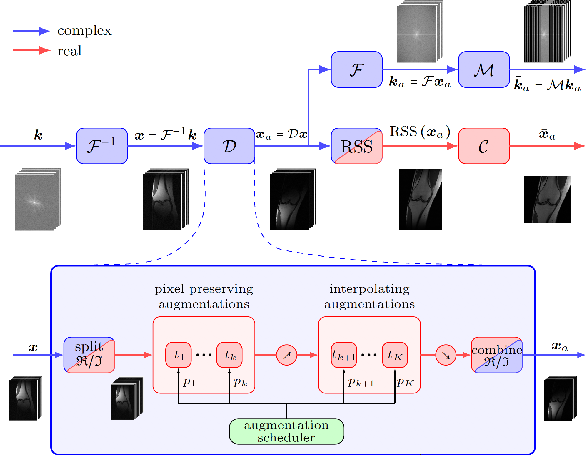

# MRAugment


MRAugment is a physics-aware data augmentation pipeline for accelerated MRI that can greatly improve reconstruction quality when training data is scarce.



This PyTorch implementation accompanies the ICML2021 paper *Data augmentation for deep learning based accelerated MRI reconstruction with limited data*.

This repository contains code to train and evaluate a [VarNet](https://arxiv.org/abs/2004.06688) model on publicly available MRI reconstruction datasets, however MRAugment can be used with any deep learning model.

Adding MRAugment data augmentation to existing training scripts only takes a couple of lines of extra code. See example usage on fastMRI data [here](mraugment_examples/train_varnet_fastmri.py).

## Requirements
CUDA-enabled GPU is necessary to run the code. We tested this code using:
- Ubuntu 18.04
- CUDA 11.1
- Python 3.8.5

## Installation
To install the necessary packages, create a new virtual environment and run
```
git clone --recurse-submodules https://github.com/z-fabian/MRAugment
cd MRAugment
./install.sh
```

## Datasets
### fastMRI
FastMRI is an open dataset, however you need to apply for access at https://fastmri.med.nyu.edu/. To run the experiments from our paper, you need the download the fastMRI knee dataset with the
following files:
- knee_singlecoil_train.tar.gz
- knee_singlecoil_val.tar.gz
- knee_multicoil_train.tar.gz
- knee_multicoil_val.tar.gz

After downloading these files, extract them into the same directory. W Make sure that the directory contains exactly the following folders:
- singlecoil_train
- singlecoil_val
- multicoil_train
- multicoil_val

### Stanford datasets
Please follow [these instructions](data/stanford/README.md) to batch-download the Stanford datasets.
Alternatively, they can be downloaded from http://mridata.org volume-by-volume at the following links:
- [Stanford 2D FSE](http://mridata.org/list?project=Stanford%202D%20FSE)
- [Stanford Fullysampled 3D FSE Knees](http://mridata.org/list?project=Stanford%20Fullysampled%203D%20FSE%20Knees)

After downloading the .h5 files the dataset has to be converted to a format compatible with fastMRI modules. To create the datasets used in the paper please follow the instructions [here](data/stanford/README.md).

## Training
### fastMRI knee
To train a VarNet model on the fastMRI knee dataset, run the following in the terminal:
```
python mraugment_examples/train_varnet_fastmri.py \
--config_file PATH_TO_CONFIG \
--data_path DATA_ROOT \
--default_root_dir LOG_DIR \
--gpus NUM_GPUS
```
- `PATH_TO_CONFIG`: path do the `.yaml` config file containing the experimental setup and training hyperparameters. Config files to each experiment in the paper can be found in the `mraugment_examples/experiments` folder. Alternatively, you can create your own config file, or directly pass all arguments in the command above.
- `DATA_ROOT`: root directory containing fastMRI data (with folders such as `multicoil_train` and `multicoil_val`)
- `LOG_DIR`: directory to save the log files and model checkpoints. Tensorboard is used as default logger.
- `NUM_GPUS`: number of GPUs used in DDP training assuming single-node multi-GPU training.

### Stanford datasets
Similarly, to train on either of the Stanford datasets, run
```
python mraugment_examples/train_varnet_stanford.py \
--config_file PATH_TO_CONFIG \
--data_path DATA_ROOT \
--default_root_dir LOG_DIR \
--gpus NUM_GPUS
```
In this case `DATA_ROOT` should point directly to the folder containing the *converted* `.h5` files.

**Note**: Each GPU is assigned whole volumes of MRI data for validation. Therefore the number of GPUs used for training/evaluation cannot be larger than the number of MRI volumes in the validation dataset. We recommend using 4 or less GPUs when training on the Stanford 3D FSE dataset.

## Experiment selection
Config files for different experiments can be found [here] (`mraugment_examples/experiments`). In general, the config files are named as `{TRACK}_train{SIZE}_{DA}.yaml`, where
- `TRACK` is either `singlecoil` or `multicoil`
- `SIZE` describes the percentage of training data used (for example `train10` uses 10% training data)
- `DA` denotes that data augmentation is turned on
Furthermore, for scanner transfer experiments `{TRAIN}T{VAL}T` denotes the field strength of scanners in the train and val datasets.

## Evaluating models
### fastMRI knee
To evaluate a model trained on fastMRI knee data on the validation dataset, run
```
python mraugment_examples/eval_varnet_fastmri.py \
--checkpoint_file CHECKPOINT \
--data_path DATA_DIR \
--gpus NUM_GPUS \
--challenge TRACK
```
- `CHECKPOINT`: path to the model checkpoint `.ckpt` file
- `TRACK`: must be `singlecoil` or `multicoil` and has to match the acquisition type the model has been trained on

**Note**: by default, the model will be evaluated on 8x acceleration.

### Stanford datasets
To evaluate on one of the Stanford datasets run
```
python mraugment_examples/eval_varnet_stanford.py \
--checkpoint_file CHECKPOINT \
--data_path DATA_DIR \
--gpus NUM_GPUS \
--train_val_split TV_SPLIT \
--train_val_seed TV_SEED
```
- `TV_SPLIT`: portion of dataset to be used as training data, rest is used for validation. For example if set to `0.8` (default), then 20% of data will be used for evaluation now.
- `TV_SEED`: seed used to generate the train-val split. By default, the config files for the various experiments use `0` for training.

## Custom training
To experiment with different data augmentation settings see all available training options by running
```
python mraugment_examples/train_varnet_fastmri.py --help
```
Alternatively, the `.yaml` files in `mraugment_examples/experiments` can be customized and used as config files as described before.
You can also take a look at the configurable parameters with respect to data augmentation in `mraugment/data_augment.py`.

## Implementation differences
Slight differences from the published results is possible due to some implementation differences. This repository uses `torchvision==0.9.1` for data augmentations, whereas the original code used the `skimage` library. 
- `torchvision==0.9.1` doesn't support bicubic interpolation (as in the paper) for the affine transform on tensors. Instead, bilinear interpolation is used. 
- The affine transform in `torchvision` is parameterized by a single scaling parameter and shearing along the x and y axes. The results in the paper were generated using a single shearing parameter and scaling along x and y axes (isotropic/anisotropic scaling).

## Citation
Coming soon.

## Acknowledgments and references
- [fastMRI repository]( https://github.com/facebookresearch/fastMRI)
- **fastMRI**: Zbontar et al., *fastMRI: An Open Dataset and Benchmarks for Accelerated MRI, https://arxiv.org/abs/1811.08839*
- **Stanford 2D FSE**: Joseph Y. Cheng, https://github.com/MRSRL/mridata-recon/
- **Stanford Fullysampled 3D FSE Knees**: Epperson K, Sawyer AM, Lustig M, Alley M, Uecker M., *Creation Of Fully Sampled MR Data Repository For Compressed Sensing Of The Knee. In: Proceedings of the 22nd Annual Meeting for Section for Magnetic Resonance Technologists, 2013*
